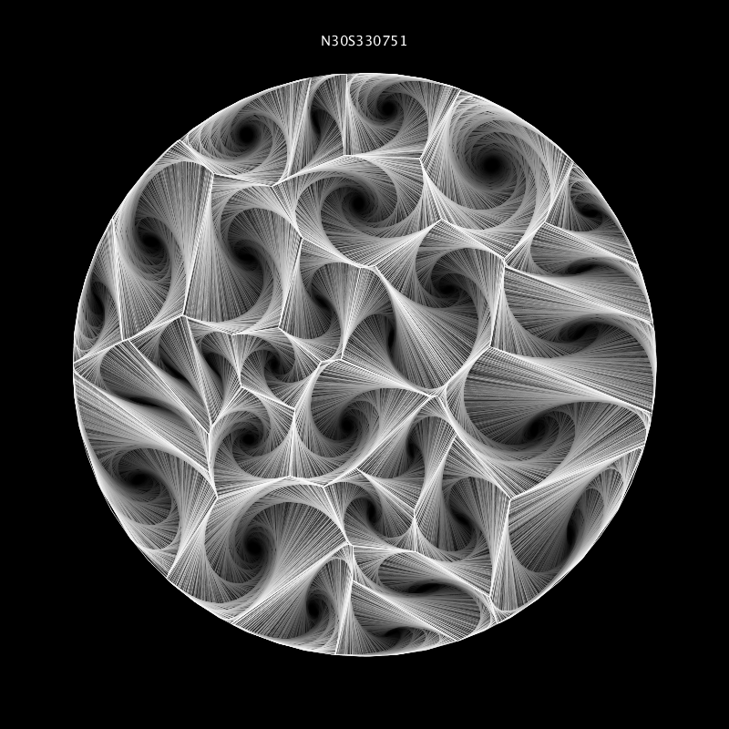
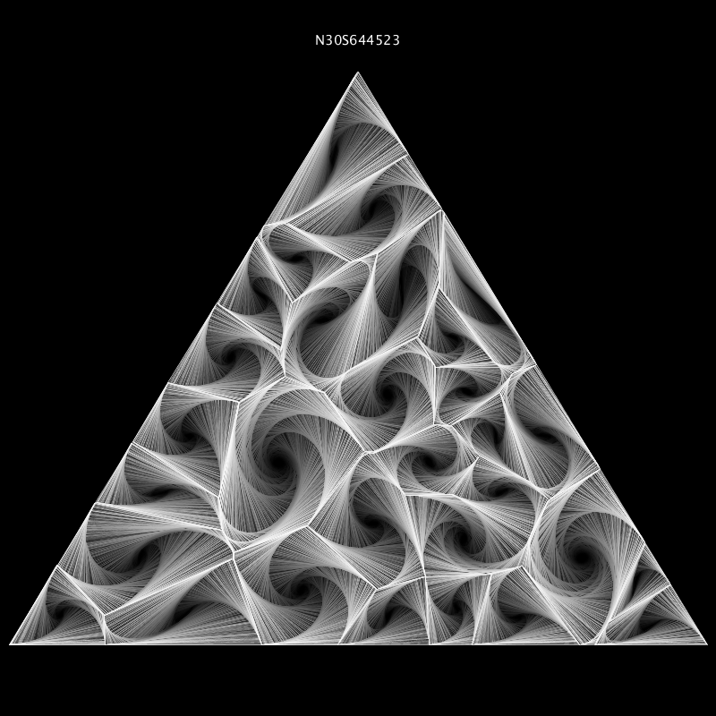
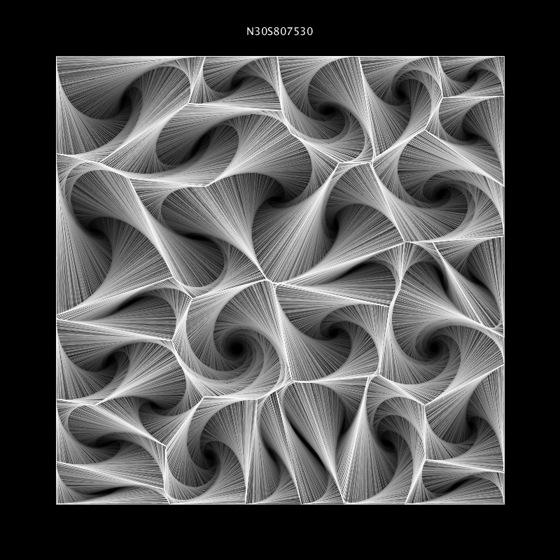
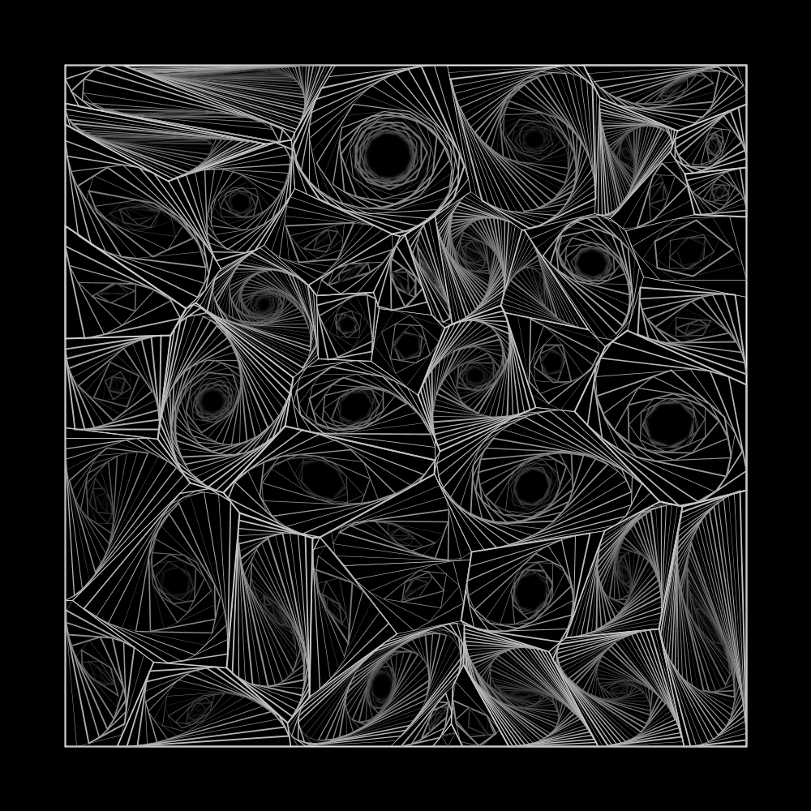
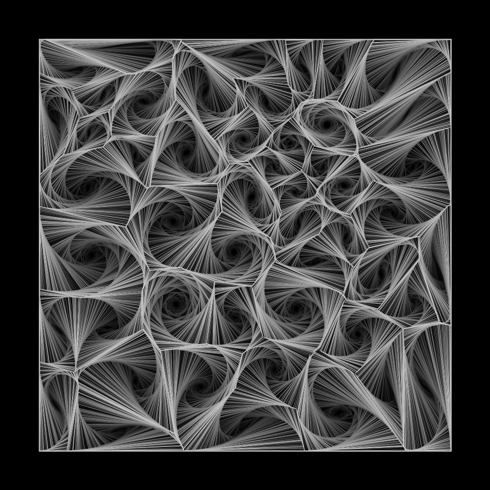

# This Project Randomly Generates Polygon Whirls Using Python + Processing

# Instruction
## Step 1: 
Install the following libraries in your python 3.6+ environment: 
* scipy
* numpy
* shapely
* fastapi
* uvicorn 
  
Then run /python_server/server.py
## Step 2:
Create a python2.7 environment and install requests library. 
Finally, copy&paste your python2.7 environment directory to line #8 of /processing_visualizations/Voronoi_Whirl/Voronoi_Whirl.pyde 
All done!
  

# Here are some of the outputs you can get.

